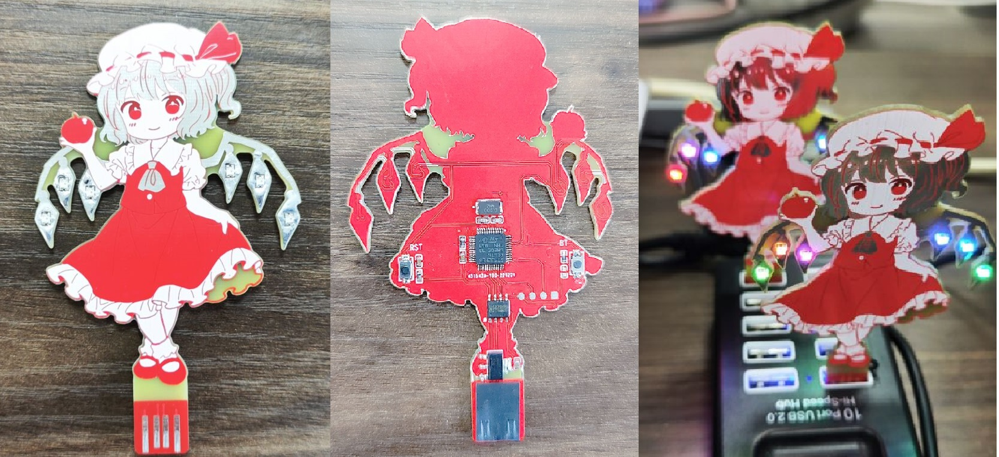
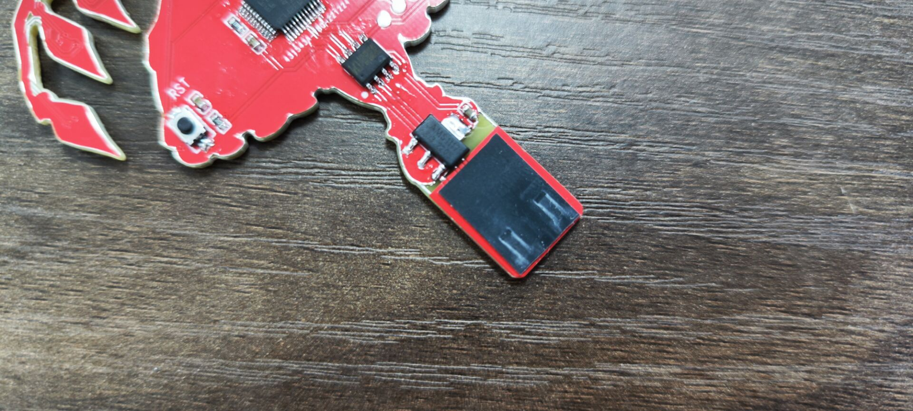

# Fraduino_ST

## Introduction

This is a replica of [「KNMK-0001A “Fraduino”」](http://yuki-factory.main.jp/moe-pcb.html), with a different microcontroller.

Shape reference: <https://oshwhub.com/akikyoua/dong-fang-project_flandre-scarlet>

## Hardware

Fraduino_ST microcontroller uses STM32F103Cx(C4/C6/C8/CB, STM32FEBKCx is also compatible).

Since the thickness of the USB plug is about 2.2mm, and the thickness of the PCB is generally unreachable, you can use a 2mm PCB (maybe expensive), or a 1.6mm PCB with a 0.5mm self-adhesive silicone strip, or a 1.2mm PCB with a 1mm self-adhesive silicone strip (10~12mm).

## Firmware

Fraduino_ST firmware uses Visual Studio Code and PlatformIO IDE, and the sample program can be directly burned.

The burning program needs to use the serial port, please ensure that the [CH340 driver](http://www.wch-ic.com/products/CH340.html) is installed.

Method to enter burning mode: Press BT (hold) -> Press RST -> Release RST -> Release BT.
